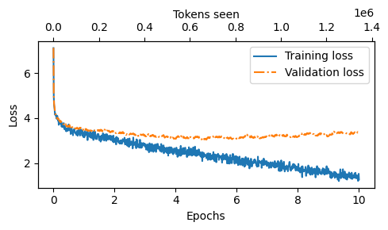

# Nepali Lekhak

Nepali Lekhak is a **Nepali-centric Large Language Model (LLM)** designed for research, experimentation, and practical applications in **Nepali NLP**.  
It is built with a focus on **efficiency, simplicity, and extensibility** — making it suitable for fine-tuning, downstream tasks, and benchmarking.

---

## Features
- Tokenization and pre-processing tailored for Nepali text.
- Configurable training pipeline for reproducibility.
- Modular design for easy experimentation.
- Support for fine-tuning on downstream tasks.
- Extensible architecture for integrating new models and datasets.

## Model Summary
   ```bash
   $ ./scripts/model_summary.sh
      INFO:src.models.llm.nep_gpt:Total parameters: 86,760,960
      INFO:src.models.llm.nep_gpt:Trainable parameters: 86,760,960
      INFO:src.models.llm.nep_gpt:Total size of the model: 0.65 GB
   ```
## Training Loss

---
Project Organization
------------

    ├── LICENSE
    ├── Makefile <- Commands like make data or make train
    ├── README.md <- Project overview and documentation
    │
    ├── artifacts <- Tokenizers, vocab files, generated text, and checkpoints
    │
    ├── configs <- YAML configuration files for model, training, and dataloader
    │
    ├── data
    │ ├── external <- Data from third-party sources
    │ ├── interim <- Intermediate transformed data
    │ ├── processed <- Final, canonical datasets for modeling
    │ └── raw <- Original, immutable data dumps
    │
    ├── docs <- Documentation (Sphinx project)
    │
    ├── models <- Trained and serialized models, predictions, or summaries
    │
    ├── notebooks <- Jupyter notebooks (naming: 1.0-abc-description)
    │
    ├── references <- Data dictionaries, manuals, and explanatory materials
    │
    ├── reports <- Generated analysis (HTML, PDF, LaTeX, etc.)
    │ └── figures <- Generated graphics and figures
    │
    ├── requirements.txt <- Python dependencies
    ├── setup.py <- Makes project pip installable (pip install -e .)
    │
    ├── scripts <- Shell scripts for training, tokenization, etc.
    │
    ├── src <- Source code
    │ ├── init.py <- Makes src a Python module
    │ │
    │ ├── data <- Data loading, preprocessing, tokenization
    │ ├── features <- Feature engineering scripts
    │ ├── inference <- Inference and text generation utilities
    │ ├── models <- Model definitions and training logic
    │ ├── training <- Training loop, configs, metrics, checkpointing
    │ └── visualization <- Visualization utilities
    │
    └── tox.ini <- Settings for automated testing with tox

--------


---

## Getting Started

1. **Clone the repository**
   ```bash
   git clone https://github.com/samarth1029/nepali-lekhak.git
   cd nepali-lekhak
2. **Install dependencies**
    ```bash
    pip install -r requirements.txt
3. **Train tokenizer**
    ```bash
    scripts/train_tokenizer.sh
4. **Train model**
    ```bash
    scripts/train_model.sh
5. **Generate text**
    ```bash
    scripts/generate.sh
---
## Documentation

Full documentation can be built using Sphinx:
```bash
cd docs
make html

